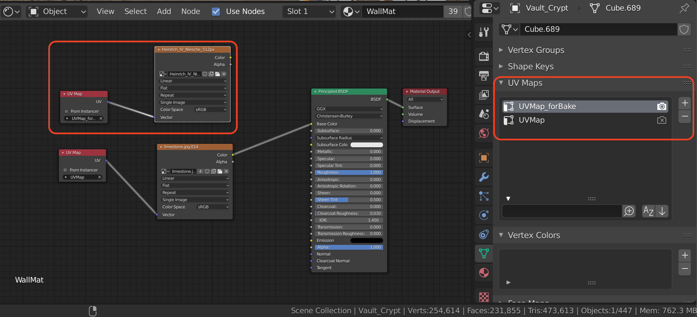

# Bachelorprojekt | Blender

  

Dieses Projekt stellt den ersten Teil meines Bachelorprojekts dar.

In diesem Teil wurde in Blender ein 3D-Modell der Krypta des Speyerer Doms erstellt. Die fertigen Modelle sind im Unity-Projekt unter den [Assets](https://github.com/dsteige1/bachelorarbeit_unity/tree/master/Assets/Models) zu finden.

  

## Generell

- Die Modellierung geschah auf Basis des 360°-Rundgangs [Kaiserdom Virtuell](https://www.kaiserdom-virtuell.de/#/2/16/10/Panorama)

- Alle Modelle wurden von Grund auf selbst modelliert

- Ich habe versucht, so viele Modelle wie möglich und so wenige wie nötig zu duplizieren und mehrfach zu verwenden (z.B.: die Gewölbe-Decke, Säulen, Wandteile,...) um später weniger Materialien erstellen zu müssen

  
  

## Texturierung

- Die Texturen bestehen zu fast 100% aus Bild-Texturen

- Um dem Original-Objekt möglichst gerecht zu werden, habe ich verschiedene [Sand- und Kalkstein-Bilder](https://github.com/dsteige1/bachelorarbeit_blender/tree/master/materials) benutzt und diese auf die Modelle gelegt

- Dafür habe ich UV-Maps von den Modellen erstellt, um so die einzelnen _Faces_ der Objekte korrekt auf die Image-Textur zu legen, bzw. umgekehrt, die Image-Textur wie gewünscht auf dem Modell auszurichten

## Export

- Das komplette Modell wurde in 6 Teilen exportiert, um flexibler zu sein, falls Anpassungen nötig sind (was der Fall war)

- Mittelteil, Süd-/ und Nordflügel, Chrokrypta, Vorkrypta und Gruft

- Nach den ersten Exporten mussten haupstächlich _Normals_ (welche die Außenseite einer _Face_ festlegen) gedreht werden, damit die einzelnen Faces von der richtigen Seite sichtbar sind. Wenn man das Modell von außen betrachtet, fällt somit auf, dass manche Flächen – von außen – durchsichtig sind

### Export der Texturen

- Dies war mitunter der schwerste und langwierigste Part des Export-Prozesses

- Um unnötigen Aufwand zu vermeiden habe ich Objekte weitestgehende zusammengefasst (z.B.: Altäre, Wandteile, große Architekturen), um nicht zu viele einzelne Texturen erstellen zu müssen

- Um die Texturen zu exportieren, habe ich sie auf eine quadratische Image-Textur _gebaked_

- Dafür musste eine neue UV-Map erstellt werden, welche die Materialen eines Objekts auf eine quadratische, zweidimensionale (U und V) Fläche legt

- Auf diese Fläche wurden dann die verschiedenen Texturen gerendert

- Dieses Bild wurde dann gespeichtert und konnte als _Albedo_-Map in Unity als Material angelegt werden

- Wichtig dabei ist, dass exakt die UV-Map mit exportiert wurde, die auch für den _Bake_ benutzt wurde, da Unity später sonst nicht weiß, wie das Material korrekt auf das Modell gelegt werden soll

- Dafür muss die korrekte UV-Map in Blender den ersten Slot (in den Object-Data) belegen, da nur die erste UV-Map mit exportiert wird
- 

#### Erstellt mit Blender-Version: 2.80